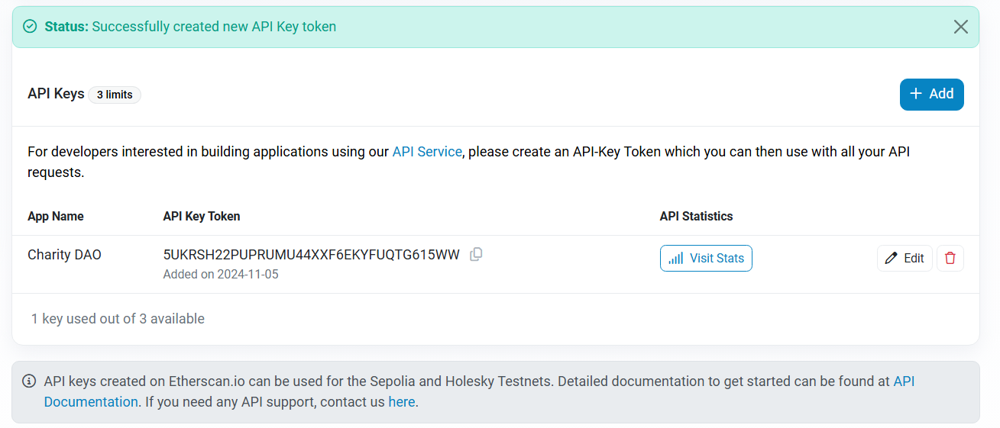
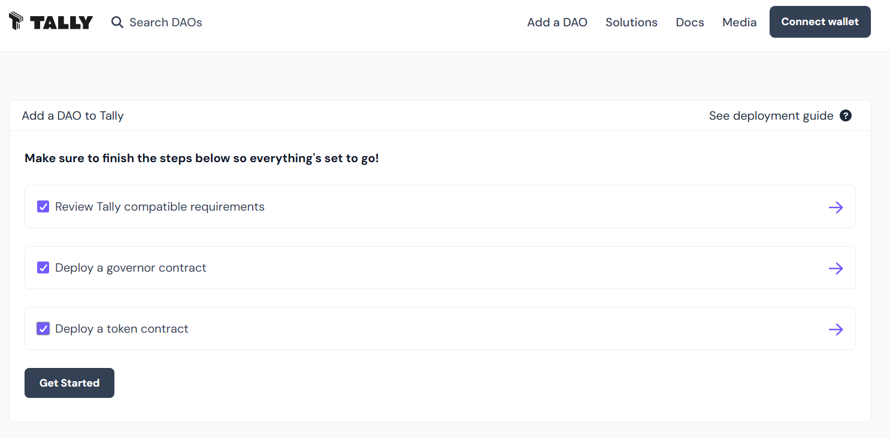
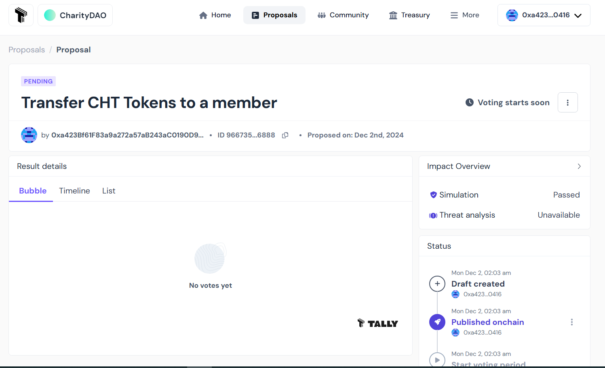

# Developing, Deploying and Operating a Decentralized Autonomous Organization (DAO)


*Author: Rodrigue KONAN TCHINDA*,
*Published on: 1-Dec-2024*

A Decentralized Autonomous Organization (DAO) is an organization where the rules of
operation and organizational logic are encoded as a smart contracts that are deployed on a blockchain. DAOs have interesting characteristics such as decentralization, transparency, and independence which make them an excellent choice for organizations that manage public goods.
In this article, we'll walk through the process starting from implementation to operation of a DAO, using the example of a charitable organization.


## What are we going to build?

In order to illustrate the entire process of developing, deploying and managing a DAO, we'll use a simple example of a Charity Organization. The DAO in question, which we'll call Charity DAO, will collect funds and allocate them to charitable acts. Donors can become members by obtaining tokens as a reward for their donations. These tokens will enable them to participate in the governance of the DAO, where they will have the opportunity to influence the orientation of the use of their donations. Charity actions will consist of transfers of funds in the form of ethers to help entities in need. Any such aid to be provided by the Charity DAO will begin with the submission of a proposal. This will then be subject to a vote by the members, to decide whether or not to accept it. Once the proposal has been accepted by the majority, it can be executed and the funds actually sent to the beneficiary entity whose address has been indicated in the proposal.

The choice of a DAO is particularly important here, in that it ensures totally transparent management of the funds collected, and streamlines the aid provided by the DAO through democratic management.

## Architecture of the Charity DAO
The Charity DAO consists of three smart contracts:

- CharityGovernor is responsible for setting the governance rules of the DAO. It is through it that proposals are submitted and DAO members cast their votes where vote power depends on the quantity of tokens held by a given user. It is also responsible for managing the proposal lifecycle. Once a proposal has been validated, it can then send it to CharityTimelock for execution.
- CharityToken is the DAO's governance token. All members must possess it to participate in voting on proposals. It will tracks token balance as well as vote power delegation. 
- CharityTimelock is responsible for executing validated proposals. It introduces a delay before execution, so that execution can be cancelled in the event that it causes problems for the DAO. CharityTimelock also plays the role of the CharityTreasury responsible for managing the DAO's funds and tokens. It enables transparent management of donations. In CharityTreasury, donations are rewarded with tokens, enabling donors to participate in the management of donated funds. In our implementation CharityTreasury is implemented as a separate abstract contract which is then inherited by CharityTimelock.

## Development of Charity DAO
### Development environment
To develop our DAO, we'll need [VSCode](https://code.visualstudio.com/download), [Node.js](https://nodejs.org/en/learn/getting-started/how-to-install-nodejs), [yarn](https://yarnpkg.com/en/docs/install), and [Hardhat](https://hardhat.org/hardhat-runner/docs/getting-started#installation). You can also install [Hardhat for Visual Studio Code](https://hardhat.org/hardhat-vscode), the extension that adds support for solidity to VSCode. The associated websites show how to install them.

When the environment is ready, the follwong command can be used to initialize a new project and create a package.json file.
```shell
yarn init -y
```
After that, install the hardhat package as a development dependency:
```shell
yarn add --dev hardhat
```
Then initialize a new Hardhat project:
```shell
npx hardhat init
```
Choose 'Create a JavaScript project' and accept everything except package installation. Install the following dependencies after that:

```shell
yarn add --dev @nomicfoundation/hardhat-ethers @nomicfoundation/hardhat-verify ethers dotenv
```

In the project structure created by default, we will add a folder named “scripts” where will reside our scripts. Then, we will delete the _test_ and _ignition_ folders that we won't be using.

We'll be using the [Openzeppelin](https://www.openzeppelin.com/) library to develop our contracts. Openzeppelin is an open-source library of pre-audited, reusable smart contract components used for secure smart contract development. The library can be install with the command: 

```shell
yarn add @openzeppelin/contracts
```
To make the creation of smart contracts even easier, Openzeppelin provides a tool called [Openzeppelin Wizard](https://wizard.openzeppelin.com/) which enables the generation of smart contract code. With this tool, we created the code used as starting points for CharityToken and CharityGovernor contracts of the Charity DAO. 

The Charity DAO consists of three smart contracts: CharityToken, CharityGovernor and CharityTimelock. CharityTimelock is also the treasury and inherits the treasury functionalities from the CharityTreasury abstract contract.

The code of the CharityToken is given below. CharityToken is an ERC20 Token that inheries for a number of Openzeppelin extensions inclusing _ERC20Votes_, _ERC20Permit_, _ERC20Burnable_, _Ownable_. _ERC20Votes_ extension adds Voting capabilities to an ERC20 token. It assign voting power to token holder based on their token balance. Hence, the more tokens a user own, the greater their voting power. The ERC20Votes extension also allows a user to delegate their voting power to another. The _ERCPermit_ extension enables token holders to allow without paying gas, third parties to transfer from their account. The _ERC20Burnable_ extension allows token holder to destroy their tokens. The _Ownable_ extension as for it, provides a basic access control mechanism, where there is an account (an owner) that can be granted exclusive access to specific functions by decorating them with the _onlyOwner_ modifier that it makes available. This extension also allows the owner to transfer the ownership to another account.

The _mint_ function was added to CharityToken to allow the owner (by applying the _onlyOwner_ modifier) to create more supply.


```solidity
// ./CharityToken.sol
...
contract CharityToken is ERC20, ERC20Burnable, Ownable, ERC20Permit, ERC20Votes {

    constructor(address initialOwner)
        ERC20("CharityToken", "CHT")
        Ownable(initialOwner)
        ERC20Permit("CharityToken")
    {}

    function mint(address to, uint256 amount) public onlyOwner {
        _mint(to, amount);
    }       
            
    // functions  that are overrides required by Solidity.
    ...
}

```


CharityTreasury is an abstract contract that implements the functionalities we desire for the treasure. This treasury is controlled by an owner which is the only account able to perform certain operations on the treasury such as minting new tokens, burning tokens, transferring assets from the treasury to another account, etc. For the Charity DAO, donations are made by interacting directly with the treasury contract. The donor must call the _donate_ function with the desired amount of ethers, specifying whether he or she wants to receive CharityTokens as a reward or not. If he chooses to receive tokens, he will receive a quantity of tokens proportional to the number of ethers donated. The _transferEthers_ and _transferTokens_ functions are used to transfer assets from the treasury to a specified address. This address may be that of the entity the CharityDAO wishes to help. Finally, the _releaseEthers_ and _releaseTokens_ functions are used to send the total treasury balance to a given address. This can be used, for example, when the treasury is to be transferred to a new address and the assets are to be transferred to that address. 

```solidity
// ./CharityTreasury.sol
...
abstract contract CharityTreasury is Ownable, ReentrancyGuard{

    uint256 _amountOfTokenForOneEther = 2;
    mapping(address => uint256) _donations;
    CharityToken _token;

    event NewDonation(address donor, uint256 amount);
    event TokensTransferToBeneficiary(address beneficiary, uint256 amount);
    event EthersTransferToBeneficiary(address beneficiary, uint256 amount);

    constructor(address initialOwner, CharityToken _ctk) Ownable(initialOwner) {
        _token = _ctk;
    }

    function mintTokens(uint256 amount) public onlyOwner {
        _token.mint(address(this), amount);
    }
    function burnTokens(uint256 amount) public onlyOwner {
        _token.burn(amount);
    }
    function donate(bool acceptTokenReward) public payable {
        _donations[msg.sender] += msg.value;

        if(acceptTokenReward){
            sendTokensToRewardDonor(msg.value, msg.sender);
        }
        emit NewDonation(msg.sender, msg.value);
    }

    function isDonor(address user) public view returns(bool) {
        return _donations[user] > 0;
    }
    function getUserTotalDonations(address user) public view returns(uint256) {
        return _donations[user];
    }

    function sendTokensToRewardDonor(uint256 amountDonated, address donor) private onlyOwner {
         uint256 amountOfCHT = amountDonated * _amountOfTokenForOneEther;
        require(_token.balanceOf(address(this)) > amountOfCHT, "Insufficient Tokens");
        _token.transfer(donor, amountOfCHT);
    }

    function getAmountOfTokenForOneEther() public view returns(uint256) {
        return _amountOfTokenForOneEther;
    }
    function setAmountOfTokenForOneEther(uint256 amount) public onlyOwner{
        _amountOfTokenForOneEther = amount;
    }

    //This method is protected against reentrancy attack using the nonReentrant modifier
    function transferEthers(address payable beneficiary, uint256 amount) public onlyOwner nonReentrant {
        require(amount > address(this).balance, "Insufficient funds!");
        // Call returns a boolean value indicating success or failure. This is the recommended method to use
        (bool sent, ) = beneficiary.call{value: amount}("");
        require(sent, "Transfer failled!");
        emit EthersTransferToBeneficiary(beneficiary, amount);
    }

    // Tranfer tokens from the tresury to a given beneficiary
    function transferTokens(address beneficiary, uint256 amount) public onlyOwner {
        require(_token.balanceOf(address(this)) > amount, "Insufficient Tokens");
        _token.transfer(beneficiary, amount);
        emit TokensTransferToBeneficiary(beneficiary, amount);
    }
    
    // Send all the ethers held by the treasury to a given address 
    function releaseEthers(address beneficiary) public onlyOwner {
        uint256 ethTreasuryBalance = address(this).balance;
        payable(beneficiary).transfer(ethTreasuryBalance);
        emit EthersTransferToBeneficiary(beneficiary, ethTreasuryBalance);
    }
    
    // Send all the tokens held by the treasury to a given address 
    function releaseTokens(address beneficiary) public onlyOwner {
        uint256 tokenTreasuryBalance = _token.balanceOf(address(this));
        _token.transfer(beneficiary, tokenTreasuryBalance);
        emit TokensTransferToBeneficiary(beneficiary, tokenTreasuryBalance);
    }
}
```

```solidity
...
// ./CharityTimelock.sol
...
contract CharityTimelock is TimelockController, CharityTreasury {
    constructor(
        uint256 _minDelay,
        address[] memory _proposers,
        address[] memory _executors,
        address admin, 
        address initialOwner, 
        CharityToken _ctk
    ) TimelockController(_minDelay, _proposers, _executors, admin) CharityTreasury(initialOwner, _ctk){}
}

```

```solidity
// ./CharityGovernor.sol
...
contract CharityGovernor is Governor, GovernorSettings, GovernorCountingSimple, GovernorVotes, GovernorVotesQuorumFraction, GovernorTimelockControl {
    constructor(IVotes _token, TimelockController _timelock, 
                uint48 initialVotingDelay, uint32 initialVotingPeriod, uint256 initialProposalThreshold,
                uint256 quorumNum)
        Governor("CharityGovernor")
        GovernorSettings(initialVotingDelay, initialVotingPeriod, initialProposalThreshold)
        GovernorVotes(_token)
        GovernorVotesQuorumFraction(quorumNum)
        GovernorTimelockControl(_timelock)
    {}

    // functions that are overrides required by Solidity.
    ...
}
```

The source code of the enitre project can be found at https://github.com/KTRDeveloper/charity-dao.


## Deploying the DAO
Our Charity DAO will be deployed on the Sepolia testnet. The first step is to obtain Sepolia ethers through faucets such as [Alchemy](https://www.alchemy.com/faucets/ethereum-sepolia) or [Google](https://cloud.google.com/application/web3/faucet/ethereum/sepolia). We'll then need a node connected to the testnet that will enable us to sign and send our transactions on the network. Fortunately, we won't have to configure and operate a node ourselves. Services such as [Infura](https://www.infura.io/) (Now part of [MetaMask Developer](https://developer.metamask.io/)) and [Alchemy](https://www.alchemy.com/) allow us to interact with the network without having to operate a node ourselves. For this article, we've chosen to use Infura. To use it, you'll need to create an account on Infura and log in ; then obtain and configure an API key that will be used to connect to an Infura node to relay our transactions. The steps below show how to obtain an API key on Infura.

1. Create an account by heading to https://developer.metamask.io/register and providing the requested information.
2. Open the [Infura dashboard](https://developer.metamask.io/) (https://developer.metamask.io/) (Enter your login details, if needed)


When the account is created, Infura automatically generates an API key. By default, this key can be used on all networks supported by Infura. If it has been deleted, use the following procedure to recreate one:
 1. Click on CREATE NEW API KEY
 2. From the pop-up window, provide a name, then click CREATE.
 3. Select the networks that you want your API key to access, and select Save Changes: Note that all the available networks are selected by default. You can uncheck them and select only what is needed in our case, that is Ethereum Sepolia.
3. Once the key has been created, it can be configured by clicking on Configure in the actions column. 


Make sure that the Sepolia endpoint on the Ethereum network is selected. You can select several others, but the one we're interested in here is Sepolia, as this is the network on which we'll be deploying our DAO. After that, you'll need to copy the key and save it for future use.


The next step is to generate a key on the etherscan block explorer. This key will be used to verify the contract. Contract verification enables the developer to publish the contract source code on etherscan and prove that the contract deployed there corresponds exactly to the source code provided. When building a DAO, this step is necessary to provide an increased transparency.

To verify the contracts of the DAO, we'll need to: 
1. Register to etherscan (https://etherscan.io/register)
2. Login (https://etherscan.io/login)
3. Once logged in, you will be redirected to your profile page (https://etherscan.io/myaccount)
4. On the left-hand panel, click on API Keys (or navigate to the link https://etherscan.io/myapikey)
5. Click on Add, then enter the project name (e.g. “Charity DAO”) and click on “Create New API Key”. 

    

6. Once created, you can copy the key and save it for future use.

    

Note that the key we've created on Etherscan.io can also be used on the Sepolia testnet. 

To interact with the network, we'll need several accounts. In the hardhat configuration file, accounts can be specified by filling in the accounts field of each network configuration. There are three options for that: use the node's accounts (by setting it to “remote”), a list of local accounts (by setting it to an array of hex-encoded private keys), or use a hierarchical deterministic (HD) wallet ---  a wallet which uses a seed phrase to derive public and private keys. 
The second option is what we are going to use. For security reasons, we're not going to use the private keys of our personal accounts, but instead, we're going to generate an account dedicated solely to deployment. We will need to send some Sepolia Ethers to this account for it to be able to deploy the contracts on the Sepolia testnet. To generate this account, the _scripts/acount.js_ script can be used. We simply need to run the following command, which will then produce an address along with a private key:

```shell
node scripts/acount.js 
```
The final Hardhat configuration file looks like this: 

```javascript
// hardhat.config.js
// imports ...
module.exports = {
    solidity: {
        version: '0.8.27',
        settings: {
            optimizer: {
                enabled: true,
                runs: 100,
            },
        },
    },
    networks: {
        sepolia: {
            url: `https://sepolia.infura.io/v3/${process.env.INFURA_API_KEY}`,
            accounts: [process.env.DEPLOYER_ACCOUNT_PRIVATE_KEY],
        },
    },
    etherscan: {
        apiKey: { sepolia: process.env.ETHER_SCAN_API_KEY },
    },
    sourcify: {
        enabled: false,
    },
}
```

The dotenv package was used to manage the environment variables used in the configuration file and the contents of the .env file is given below:

```
INFURA_API_KEY="your infura api key here"
ETHER_SCAN_API_KEY="your etherscan api key here"
DEPLOYER_ACCOUNT_PRIVATE_KEY="your deployer account private key here"
MEMBERS_ADDRESSES=["first member address",...,"0xb..."]
```

CharityDAO is deployed via a deployment script in the scripts folder. The contents of this script are given below:

``` javascript
// scripts/deploy.js
// imports ...
async function main() {
    const CharityToken = await ethers.getContractFactory('CharityToken')
    const CharityTimelock = await ethers.getContractFactory('CharityTimelock')
    const CharityGovernor = await ethers.getContractFactory('CharityGovernor')

    // retrive accounts from the local node
    const [deployer] = (await ethers.getSigners()).map(
        (signer) => signer.address
    )
    const members = JSON.parse(process.env.MEMBERS_ADDRESSES)
    const admin = deployer
    console.log({deployer, members})

    // Deploy token
    const charityToken = await CharityToken.deploy(deployer)
    await charityToken.waitForDeployment()

    // Deploy timelock
    const minDelay = 5 // How long do we have to wait until we can execute after a passed proposal
    // (5 blocs ~> 1 min as each block takes about 12 seconds to be validated )
    // In addition to passing minDelay, two arrays are passed:
    // The 1st array contains addresses of members who are allowed to make a proposal.
    // The 2nd array contains addresses of members who are allowed to make executions.

    const charityTimelock = await CharityTimelock.deploy(
        minDelay,
        [],
        [],
        admin,
        deployer,
        charityToken
    )
    await charityTimelock.waitForDeployment()

    // Deploy governanace
    const initialVotingDelay = 0 // Delay since proposal is created until voting starts
    const initialVotingPeriod = 75 // Length of period during which people can cast their vote. (75 blocs ~> 15 min as each block takes about 12 seconds to be validated )
    const initialProposalThreshold = 0 // Minimum number of votes an account must have to create a proposal.
    const quorum = 4 // Percentage of total supply of tokens needed to aprove proposals (4%)
    const charityGovernor = await CharityGovernor.deploy(
        charityToken,
        charityTimelock,
        initialVotingDelay,
        initialVotingPeriod,
        initialProposalThreshold,
        quorum
    )
    await charityGovernor.waitForDeployment()

    // The token contract is owned by the charityTimelock which is also the treasury
    await charityToken.transferOwnership(await charityTimelock.getAddress(), {
        from: deployer,
    })

    const supplyCHT = '1000' // 1000 Tokens
    const txMintTokens = await charityTimelock.mintTokens(
        ethers.parseEther(supplyCHT),
        {
            from: deployer,
        }
    )
    await txMintTokens.wait()

    // 50 Tokens are transfered to each member
    const amountCHT = '50'
    for (let i = 0; i < members.length; i++) {
        const txTransferTokens = await charityTimelock.transferTokens(
            members[i],
            ethers.parseEther(amountCHT),
            { from: deployer }
        )
        await txTransferTokens.wait()
    }

    // The treasury is owned by the charityTimelock
    await charityTimelock.transferOwnership(
        await charityTimelock.getAddress(),
        {
            from: deployer,
        }
    )

    // Assign roles
    const proposerRole = await charityTimelock.PROPOSER_ROLE()
    const executorRole = await charityTimelock.EXECUTOR_ROLE()
    const adminRole = await charityTimelock.DEFAULT_ADMIN_ROLE()
    await charityTimelock.grantRole(
        proposerRole,
        await charityGovernor.getAddress(),
        {
            from: deployer,
        }
    )
    await charityTimelock.grantRole(
        executorRole,
        await charityGovernor.getAddress(),
        {
            from: deployer,
        }
    )

    // Renounce admin role
    await charityTimelock.renounceRole(adminRole, deployer)

    console.log({
        token: await charityToken.getAddress(),
        timelock: await charityTimelock.getAddress(),
        governor: await charityGovernor.getAddress(),
    })
}
main()
    .then(() => process.exit(0))
    .catch((err) => {
        console.log(err)
        process.exit(1)
    })

```
Globally, the script first retrieves the addresses of deployment as well as the those of initial CharityDAO members.
It then deploys each of the CharityToken, CharityTimelock and CharityGovernor contracts. After that, 1000 Charity Token (CHT) are minted and 50 CHT is sent to each member. The deployer account, whose sole purpose is deployment, transfers ownership of the various contracts to the CharityTimelock. At the end, after assigning the _PROPOSER_ and _EXECUTOR_ roles to the CharityGovernor, the deployer account relinquishes its _DEFAULT_ADMIN_ROLE_ role.

Our DAO will then be deployed on the Sepolia testnet in the following steps:

1. Compile contracts with the command
```shell
npx hardhat compile
```
2. Deployment on Sepolia

The deployment account specified in the .env file  must have sufficient Sepolia ethers for deployment. You will need to send it Sepolia ethers from another account that has some. After that, run the following command to deploy the charity DAO.
```shell
npx hardhat run --network sepolia scripts/deploy.js
```

Once deployment is complete, the addresses of the various contracts deployed are displayed in the console. You will get an output similar to the following:
```
{
  deployer: '0x0D565Abc1F640378A4baC65c2874E16F0FE31446',
  members: [
    '0xa423Bf61F83a9a272a57aB243aC0190D977A0416',
    '0x0874207411f712D90edd8ded353fdc6f9a417903',
    '0xb88961C00ca91C1c3427c791a3659FD1cce8Bc27'
  ]
}
{
  token: '0xE9B493cAEccE4bc997D5020d3f08F70D2Cd4a79c',
  timelock: '0x211A4772C6a6727C7B03d7A78b9e79E02B4F37cc',
  governor: '0xCCd3Ed837396027e0444a1980B7A808514eF18f6'
}  
```
3. You can then go to sepolia.https://sepolia.etherscan.io and search for the contract with Token's address and confirm that it has indeed been deployed. 
Please note that you should only consider the addresses displayed in your console, as yours will differ from what's displayed here.


4. The final step is to verify the contracts. Verification is an important step, as it increases transparency by uploading the contract source code to the block explorer so that it can be viewed by everyone, and verifying that the code actually sent corresponds to the deployed contract. To perform this verification, the _@nomicfoundation/hardhat-verify_ plugin is needed. The data passed to the constructors of the various contracts at the time of deployment is also required. The following commands can be used to verify the different contracts. 

```shell
npx hardhat verify --network sepolia DEPLOYED_CONTRACT_ADDRESS “Constructor argument 1” “Constructor argument 2” ...
```
The [CharityToken](https://sepolia.etherscan.io/address/0xE9B493cAEccE4bc997D5020d3f08F70D2Cd4a79c) contract can be verified as follow:
```shell
npx hardhat verify --network sepolia 0xE9B493cAEccE4bc997D5020d3f08F70D2Cd4a79c 0x0D565Abc1F640378A4baC65c2874E16F0FE31446
```
which produces the following output:
```
Successfully submitted source code for contract
contracts/CharityToken.sol:CharityToken at 0xE9B493cAEccE4bc997D5020d3f08F70D2Cd4a79c
for verification on the block explorer. Waiting for verification result...

Successfully verified contract CharityToken on the block explorer.
https://sepolia.etherscan.io/address/0xE9B493cAEccE4bc997D5020d3f08F70D2Cd4a79c#code
```

You can see that a small green tick has appeared on the contract tab and that the [contract source code](https://sepolia.etherscan.io/address/0xE9B493cAEccE4bc997D5020d3f08F70D2Cd4a79c#code) is available on Etherscan.


For the other contracts, CharityGovernor and CharityTimeLock, the verification commands are as follows:

* For [CharityGovernor](https://sepolia.etherscan.io/address/0xCCd3Ed837396027e0444a1980B7A808514eF18f6)
```shell
npx hardhat verify --network sepolia 0xCCd3Ed837396027e0444a1980B7A808514eF18f6 0xE9B493cAEccE4bc997D5020d3f08F70D2Cd4a79c 0x211A4772C6a6727C7B03d7A78b9e79E02B4F37cc 0 75 0 4
```
* For [CharityTimeLock](https://sepolia.etherscan.io/address/0x211A4772C6a6727C7B03d7A78b9e79E02B4F37cc)
```shell
npx hardhat verify --network sepolia --contract contracts/CharityTimelock.sol:CharityTimelock --constructor-args scripts/arguments.js  0x211A4772C6a6727C7B03d7A78b9e79E02B4F37cc
```
Where _scripts/arguments.js_ file contain the exported list of the constructor arguments. This is needed when the constructor has complex argument list.

```javascript
// scripts/arguments.js
module.exports = [
    5,
    [],
    [],
    '0x0D565Abc1F640378A4baC65c2874E16F0FE31446',
    '0x0D565Abc1F640378A4baC65c2874E16F0FE31446',
    '0xE9B493cAEccE4bc997D5020d3f08F70D2Cd4a79c',
]
```

## Operating the Charity DAO
To operate our DAO, we're going to use Tally. Tally is a frontend for onchain decentralized organizations where users can delegate voting power, create or pass proposals to spend DAO funds, manage a protocol, and upgrade smart contracts. It should be noted that it is entirely possible to dispense with Tally and build a front-end from scratch that interacts with Charity DAO. This offers greater flexibility, but also requires more resources for development.

### Connecting the DAO to Tally
To interact with our DAO, we need to connect it to Tally. To do this, follow the steps below:
1. Go to Tally and click on [Tally]( https://www.tally.xyz/get-started) then select “Deploy myself” then click on “Deploy contracts myself”.


2. Check all the boxes and click on “Get started”.



3. Connect your wallet by clicking on connect wallet and choose the account with which you wish to connect. If you haven't set up a wallet yet, you can follow this guide to install and configure Metamask, which is one of the most popuplar.


4. Once the wallet is connected, click on “Sign in” and confirm the sign-in request popped up by Metamask. You will then be redirected to the page for adding a DAO, as shown in the figure below.


5. On the DAO addition page, enter the address of the previously deployed CharityGovernor and select the “Ethereum Tesnet Sepolia” network, then click on the “Fetch Details” button. Make sure your contract has been verified as described above, otherwise Tally won't be able to automatically load the details of your CharityGovernor Contract.
6. Once loaded, Tally will display the contract details.


7. Enter the name and description of the DAO in the “Basic DAO details” section, then click on the “Submit” button.


8. You will receive a confirmation and will be redirected to the [CharityDAO homepage](https://www.tally.xyz/gov/charitydao) (in our case: https://www.tally.xyz/gov/charitydao).


### The Proposal Lifecycle on Tally
First of all, we need to transfer some Sepolia Ether to the accounts that will be used to interact with the Charity DAO. Then we'll need to connect to Tally with each of these accounts and delegate voting powers. Delegation allows a token holder to transfer his/her voting power to another user (with the possibility to witdrawn at any time) while keeping the underlying assets. In fact, only delegated tokens can participate in voting and if you wish to vote directly, you will need to delegate your voting power to yourself. To delegate voting power on Tally, simply click on the Delegate button on the DAO home page and indicate the acount to which you want to delegate.


Note that to be able to use the voting power for a proposal, it should be delegated before the proposal is active. This behavior is enforced to prevent users from changing the outcome of a vote in progress by buying or borrowing additional votes.


After delegation, we can proceed to the creation of a proposal. 

We want to create a proposal that will transfer 20 CHT from the treasury to the address we're logged in with (which is 0xa423Bf61F83a9a272a57aB243aC0190D977A0416 in my case) once it's executed. To do this, we are going to follow the steps below:

1. From the CharityDAO home page, click on "Proposals", then on the “New Proposal” button.
2. Fill in the title and description


3. Add actions: Here, we want to invoke the _transferTokens_ method of the CharityTimelock contract, which is also our treasury. For that, click on the “Add Action” button, then on “Custom action” and enter CharityTimelock's address. Since the contract has been verified, the details are automatically loaded. Choose the _transferTokens_ method, then enter the destination address and the number of tokens to be transferred.


4. Then run a simulation to see if the proposal will be executed correctly once validated. To do this, click on “Impact Overview”, then on “Simulate execution”.


5. If the simulation is successful, we can then click on the “Publish” button and sign the transaction with the Wallet. Once completed, it redirects us to the proposal page, where members can cast their votes once the voting has begun.



6. To vote, each member must go to the CharityDAO home page, click on “Proposals” and select the proposal in the proposal list. The proposal page will then load, and the user can cast his/her vote by clicking on the “Vote onchain” button and choosing from the options. Connect with at least two of the accounts specified in the _.env_ and vote for the proposal to be validated. Please note that for experimental reasons, we've set the voting time to roughly 15 minutes. Make sure you vote within this timeframe for the vote to pass.


7. Once the voting period has elapsed, if quorum has been reached and the majority has voted in favor, then the proposal is validated and can be inserted into the queue for execution. This can be done by any member by clicking on the “Queue” button which has replaced the “Vote onchain” button. Once inserted in the queue, the proposal must be executed by clicking on “Execute”, which replaces the “Queue” button. When execution is complete, you can return to the home page with the same account as above and check that the number of tokens has increased from 50 to 70.


## Wrap-up

In this article, we used a charitable organization as a practical example to demonstrate the development, deployment, and operation of a Decentralized Autonomous Organization (DAO). We implemented the DAO in Solidity using the Openzeppelin library, deployed it to the Sepolia testnet, and verified the deployed contracts on Etherscan for futher transparency. Finally, Tally was employed to demonstrate the operational aspects of the DAO.


