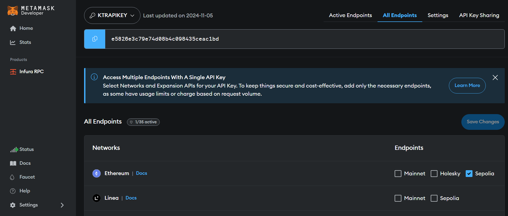
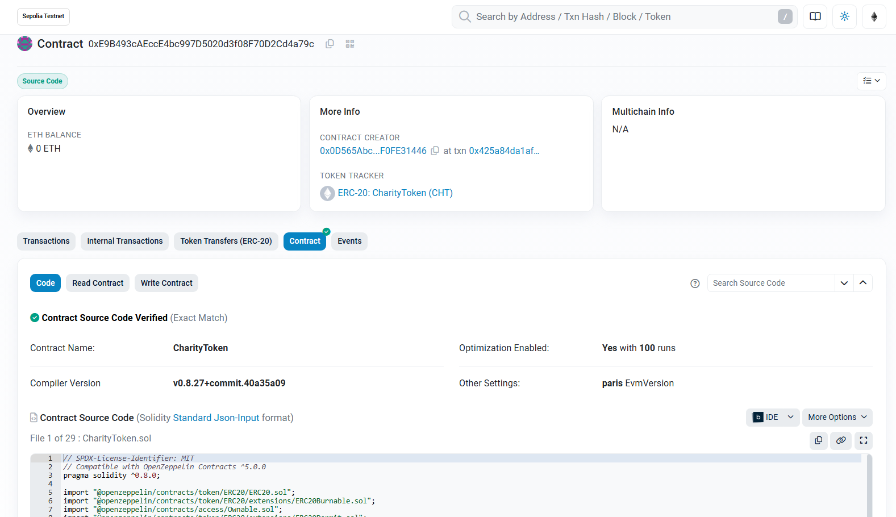
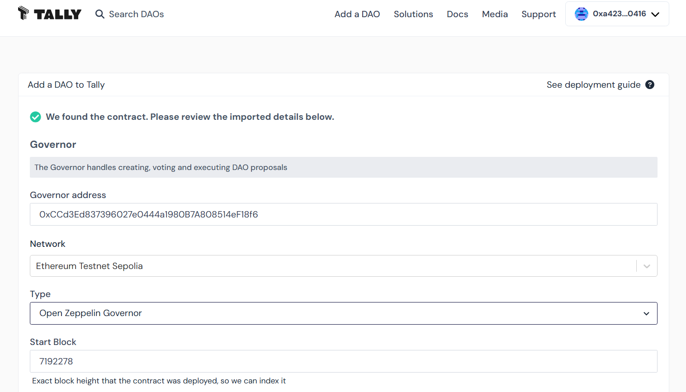
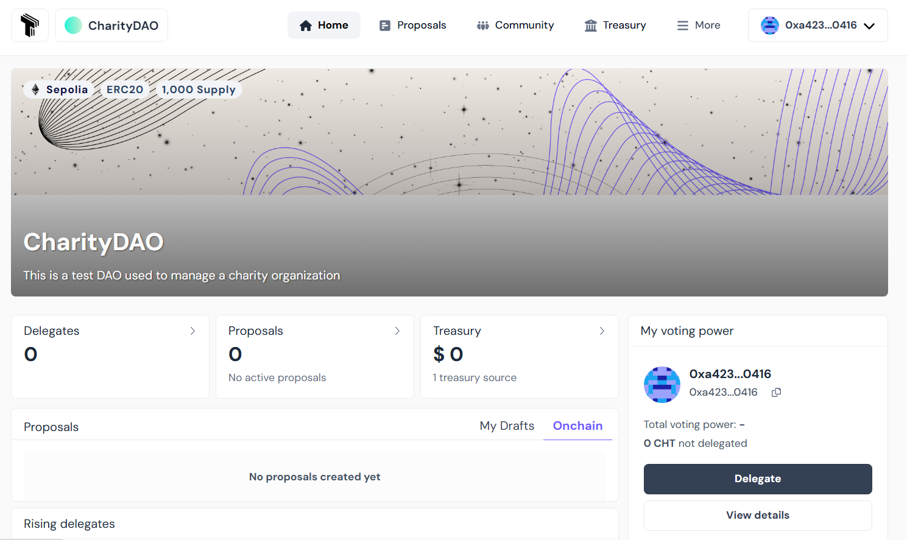

# Developing, Deploying and operating a DAO


*Author: Rodrigue KONAN TCHINDA*,
*Last update: 30-Nov-2024*
## Introduction

## What are we going to build?

In order to illustrate the entire process of developing, deploying and managing a DAO, we'll use a simple example of a Charity Organization. The DAO in question, which we'll call Charity DAO, will collect funds and allocate them to charitable acts. Donors can become members by obtaining tokens as a reward for their donations. These tokens will enable them to participate in the governance of the DAO, where they will have the opportunity to influence the orientation of the use of their donations. Charity actions will consist of transfers of funds in the form of ethers to help entities in need. Any such aid to be provided by the Charity DAO will begin with the submission of a proposal. This will then be subject to a vote by the members, to decide whether or not to accept it. Once the proposal has been accepted by the majority, it can be executed and the funds actually sent to the beneficiary entity whose address has been indicated in the proposal.

The choice of a DAO is particularly important here, in that it ensures totally transparent management of the funds collected, and streamlines the aid provided by the DAO through democratic management.

## Architecture of the Charity DAO

- CharityGovernor is responsible for the governance of the DAO. It is through it that proposals are submitted and DAO members vote. It is also responsible for managing the proposal lifecycle. Once a proposal has been validated, it can be sent to CharityTimelock for execution.
- CharityTimelock is responsible for executing validated proposals. It introduces a delay before execution, so that execution can be cancelled in the event that it causes problems for the DAO.
- CharityToken is the DAO's governance token. All members must possess it to participate in voting on proposals. 
- CharityTreasury is responsible for managing the DAO's funds and tokens. It enables transparent management of donations. Donations are rewarded with tokens, enabling donors to participate in the management of donated funds. 

## Development of Charity DAO
### Development tools
### Unit testing
Unit testing is of the utmost importance in the development of a DAO, as the slightest security flaw could lead to the theft of funds. This is such a useful subject that we'd prefer to deal with it in a later article.

## Deploying the DAO
Our Charity DAO will be deployed on the Sepolia testnet. The first step is to obtain Sepolia ethers through faucets such as [Alchemy](https://www.alchemy.com/faucets/ethereum-sepolia) or [Google](https://cloud.google.com/application/web3/faucet/ethereum/sepolia). We'll then need a node connected to the testnet that will enable us to sign and send our transactions on the network. Fortunately, we won't have to configure and operate a node ourselves. Services such as [Infura](https://www.infura.io/) and [Alchemy](https://www.alchemy.com/) allow us to interact with the network without having to operate a node ourselves. For this article, we've chosen to use Infura. To use it, you'll need to create an account on Infura and log in ; then obtain and configure an API key that will be used to connect to an Infura node to relay our transactions. The steps below show how to obtain an API key on Infura.

1. Create an account by heading to .... and providing the requested information.
2. Open the Infura dashboard (https://infura.io/dashboard) (Enter your login details, if needed)


When the account is created, Infura automatically generates an API key. By default, this key can be used on all networks supported by Infura. If it has been deleted, use the following procedure to recreate one:
 1. click on CREATE NEW API KEY
 2. From the pop-up window, provide a name, then click CREATE.
 3. Select the networks that you want your API key to access, and select Save Changes: Note that all the available networks are selected by default. You can uncheck them and select only what is needed in our case, that is Ethereum Sepolia.
3. Once the key has been created, it can be configured by clicking on Configure in the actions column. 



Make sure that the Sepolia endpoint on the Ethereum network is selected. You can select several others, but the one we're interested in here is Sepolia, as this is the network on which we'll be deploying our DAO. After that, you'll need to copy the key and save it for future use.


The next step is to generate a key on the etherscan block explorer. This key will be used to verify the contract. Contract verification enables the developer to publish the contract source code on etherscan and prove that the contract deployed there corresponds exactly to the source code provided. When building a DAO, this step is necessary to provide an increased transparency.

To verify the contracts of the DAO, we'll need to: 
1. Register to etherscan (https://etherscan.io/register)
2. Login (https://etherscan.io/login)
3. Once logged in, you will be redirected to your profile page (https://etherscan.io/myaccount)
4. On the left-hand panel, click on API Keys (or navigate to the link https://etherscan.io/myapikey)
5. Click on Add, then enter the project name (e.g. “Charity DAO”) and click on “Create New API Key”. 

    

6. Once created, you can copy the key and save it for future use.

    

Note that the key we've created on Etherscan.io can also be used on the Sepolia testnet. 

To interact with the network, we'll need several accounts. In the hardhat configuration file, accounts can be specified by filling in the accounts field of each network configuration. There are three options for that: use the node's accounts (by setting it to “remote”), a list of local accounts (by setting it to an array of hex-encoded private keys), or use a hierarchical deterministic (HD) wallet ---  a wallet which uses a seed phrase to derive public and private keys. The latter option is what we are going to use. For that, we'll need to create a seed phrase also known as a mnemonic. A mnemonic is a sequence of words that, when taken together in the correct order, can uniquely recreate the private key. To create one, we can use the following commands:

``` console
npx mnemonics
```
The final Hardhat configuration file looks like this: 


``` javascript
require('@nomicfoundation/hardhat-ethers')
require('dotenv').config()
require('@nomicfoundation/hardhat-verify')

module.exports = {
    solidity: {
        version: '0.8.27',
        settings: {
            optimizer: {
                enabled: true,
                runs: 200,
            },
        },
    },
    networks: {
        sepolia: {
            url: `https://sepolia.infura.io/v3/${process.env.INFURA_API_KEY}`,
            accounts: { mnemonic: process.env.ACCOUNTS_MNEMONIC },
        },
    },
    etherscan: {
        apiKey: { sepolia: process.env.ETHER_SCAN_API_KEY },
    },
}
```

The dotenv package was used to manage the environment variables used in the configuration file and the contents of the .env file is given below:

```
INFURA_API_KEY="Your Infura key here"
ACCOUNTS_MNEMONIC="Your Mnemonic here "
ETHER_SCAN_API_KEY="Your ether scan API key here"
```

CharityDAO is deployed via a deployment script in the scripts folder. The contents of this script are given below:

``` javascript
require('dotenv').config()

async function main() {
    const CharityToken = await ethers.getContractFactory('CharityToken')
    const CharityTimelock = await ethers.getContractFactory('CharityTimelock')
    const CharityGovernor = await ethers.getContractFactory('CharityGovernor')

    // retrive accounts from the local node
    const [deployer] = (await ethers.getSigners()).map(
        (signer) => signer.address
    )
    const members = JSON.parse(process.env.MEMBERS_ADDRESSES)
    const admin = deployer
    console.log({
        deployer,
        members,
    })

    const supply = ethers.parseEther('300') // 300 Tokens

    // Deploy token
    const charityToken = await CharityToken.deploy(deployer)
    await charityToken.waitForDeployment()

    const txmint = await charityToken.mint(deployer, supply)
    await txmint.wait()

    // 100 Tokens are given to each member and leaving 100 tokens to executor
    const amount = ethers.parseEther('100')
    members.forEach(async (member) => {
        await charityToken.transfer(member, amount, { from: deployer })
    })

    // Deploy timelock
    const minDelay = 5 // How long do we have to wait until we can execute after a passed proposal
    // (5 blocs ~> 1 min as each block takes about 12 seconds to be validated )
    // In addition to passing minDelay, two arrays are passed:
    // The 1st array contains addresses of members who are allowed to make a proposal.
    // The 2nd array contains addresses of members who are allowed to make executions.

    const charityTimelock = await CharityTimelock.deploy(
        minDelay,
        [],
        [],
        admin,
        deployer,
        charityToken
    )
    await charityTimelock.waitForDeployment()

    // Deploy governanace
    // GovernorSettings(0 /* 0 day */, 75 /* 15 minutes */, 0)

    const initialVotingDelay = 0 // Delay since proposal is created until voting starts
    const initialVotingPeriod = 75 // Length of period during which people can cast their vote. (75 blocs ~> 15 min as each block takes about 12 seconds to be validated )
    const initialProposalThreshold = 0 // Minimum number of votes an account must have to create a proposal.
    const quorum = 4 // Percentage of total supply of tokens needed to aprove proposals (4%)

    const charityGovernor = await CharityGovernor.deploy(
        charityToken,
        charityTimelock,
        initialVotingDelay,
        initialVotingPeriod,
        initialProposalThreshold,
        quorum
    )
    await charityGovernor.waitForDeployment()

    // The token contract is owned by the charityTimelock which is also the treasury
    await charityToken.transferOwnership(await charityTimelock.getAddress(), {
        from: deployer,
    })

    // 700 additional tokens are minted for tresury
    await charityTimelock.mintTokens(ethers.parseEther('700'), {
        from: deployer,
    })

    // Assign roles
    const proposerRole = await charityTimelock.PROPOSER_ROLE()
    const executorRole = await charityTimelock.EXECUTOR_ROLE()
    const adminRole = await charityTimelock.DEFAULT_ADMIN_ROLE()

    await charityTimelock.grantRole(
        proposerRole,
        await charityGovernor.getAddress(),
        {
            from: deployer,
        }
    )
    await charityTimelock.grantRole(
        executorRole,
        await charityGovernor.getAddress(),
        {
            from: deployer,
        }
    )

    ///////////// Renounce admin role
    await charityTimelock.renounceRole(adminRole, deployer)

    console.log({
        token: await charityToken.getAddress(),
        timelock: await charityTimelock.getAddress(),
        governor: await charityGovernor.getAddress(),
    })
}

main()
    .then(() => process.exit(0))
    .catch((err) => {
        console.log(err)
        process.exit(1)
    })
```

Our DAO will therefore be deployed on the Sepolia testnet in the following steps:

1. Compile contracts with the command
```
npx hardhat compile
```
2. Deployment on Sepolia

The first HD Wallet account defined above must have the Sepolia ethers required for deployment. To do this, you'll need to send it Sepolia ethers from another account that has them. To find out what the address of this account is, you can run the script once and find the address corresponding to executor, which is printed in the console.
``` 
npx hardhat run --network sepolia scripts/deploy.js
```
3. Once deployment is complete, the addresses of the various contracts deployed are displayed in the console. You can then go to sepolia.etherscan.orddd and search for the contract with Governor's address and confirm that it has indeed been deployed. 
Please note that you should only consider the addresses displayed in your console, as yours will differ from what's displayed here.

```
{
  executor: '0x0874207411f712D90edd8ded353fdc6f9a417903',
  proposer: '0xb88961C00ca91C1c3427c791a3659FD1cce8Bc27',
  voter1: '0x55691756C6Fa56DF87Ce84eC3ECC8b96d24bE7eF',
  voter2: '0x2106b275ea6DceDBF5C1CE736DD59C78D4e10ff0',
  voter3: '0x5474BC2420fCaec7d19069D414253EE8b2C230A0'
}
{
  token: '0x28f11EcBDA8d8e55Fb69e11B5538504A63646c50',
  timelock: '0xb8882eFe282FF6B4dAB556C4092252500dA844B0',
  governor: '0x2A3d6881A5a99e2d21C1C2c98D51459b0a1acB51',
  treasury: '0x7EE8A39D94208665002fBD507B1ea4c25CfD12bc'
}
```


4. The final step is to verify the contracts. Verification is an important step, as it increases transparency by uploading the contract source code to the block explorer so that it can be viewed by everyone, and verifying that the code actually sent corresponds to the deployed contract. To perform this verification, the @nomicfoundation/hardhat-verify plugin is required. The data passed to the constructors of the various contracts at the time of deployment is also required. The following commands can be used to verify the different contracts. 

```
npx hardhat verify --network sepolia DEPLOYED_CONTRACT_ADDRESS “Constructor argument 1”
```

```
npx hardhat verify --network sepolia 0x2A3d6881A5a99e2d21C1C2c98D51459b0a1acB51 0x28f11EcBDA8d8e55Fb69e11B5538504A63646c50 0xb8882eFe282FF6B4dAB556C4092252500dA844B0 0 75 0 4


Successfully submitted source code for contract
contracts/CharityGovernor.sol:CharityGovernor at 0x2A3d6881A5a99e2d21C1C2c98D51459b0a1acB51
for verification on the block explorer. Waiting for verification result...

Successfully verified contract CharityGovernor on the block explorer.
https://sepolia.etherscan.io/address/0x2A3d6881A5a99e2d21C1C2c98D51459b0a1acB51#code
```


You can see that a small green tick has appeared on the contract tab and that the contract source code is available on etherscan.

For the other contracts, CharityToken, CharityTreasury and CharityTimeLock, the verification commands are as follows

* For CharityToken

```
npx hardhat verify --network sepolia 0x28f11EcBDA8d8e55Fb69e11B5538504A63646c50 0x0874207411f712D90edd8ded353fdc6f9a417903
```
* For CharityTreasury

```
npx hardhat verify --network sepolia 0x7EE8A39D94208665002fBD507B1ea4c25CfD12bc 0x0874207411f712D90edd8ded353fdc6f9a417903 0x28f11EcBDA8d8e55Fb69e11B5538504A63646c50
```

* For CharityTimeLock
```
npx hardhat verify --network sepolia --contract contracts/CharityTimelock.sol:CharityTimelock --constructor-args scripts/arguments.js  0xb8882eFe282FF6B4dAB556C4092252500dA844B0
```
Where scripts/arguments.js file contain the exported list of the constructor arguments. This is needed when the constructor has complex argument list.

```
module.exports = [
    5,
    ['0xb88961c00ca91c1c3427c791a3659fd1cce8bc27'],
    ['0x0874207411f712d90edd8ded353fdc6f9a417903'],
    '0x0874207411f712d90edd8ded353fdc6f9a417903',
]
```

## Operating the Charity DAO
To operate our DAO, we're going to use Tally. Tally is a frontend for onchain decentralized organizations where users can delegate voting power, create or pass proposals to spend DAO funds, manage a protocol, and upgrade smart contracts. It should be noted that it is entirely possible to dispense with Tally and build a front-end from scratch that interacts with Charity DAO. This offers greater flexibility, but also requires more resources for development.

To interact with our DAO, we need to connect it to Tally. To do this, follow the steps below:
1. Go to Tally and click on [Tally]( https://www.tally.xyz/get-started) then select “Deploy myself” then click on “Deploy contracts myself”.

2. Check all the boxes and click on “Get started”.

3. Connect your wallet by clicking on connect wallet and choose the account with which you wish to connect. If you haven't set up a wallet yet, you can follow this guide to install and configure Metamask, which is one of the most popuplar.

4. Once the wallet is connected, click on “Sign in” and confirm the sign-in request popped up by Metamask. You will then be redirected to the page for adding a DAO, as shown in the figure below.


5. On the DAO addition page, enter the address of the previously deployed CharityGovernor and select the “Ethereum Tesnet Sepolia” network, then click on the “Fetch Details” button. Make sure your contract has been verified as described above, otherwise Tally won't be able to automatically load the details of your CharityGovernor Contract.
6. Once loaded, Tally will display the contract details.

7. Enter the name and description of the DAO in the “Basic DAO details” section, then click on the “Submit” button.

8. You will receive a confirmation and will be redirected to the CharityDAO homepage.



## Conclusion


