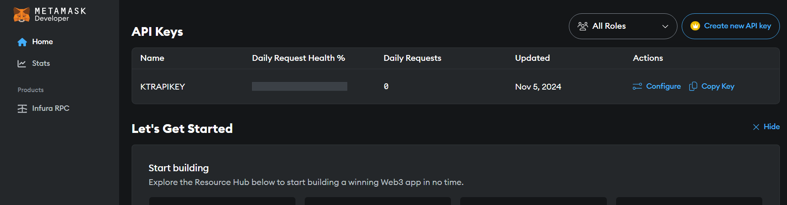

# Developing, Deploying and operating a DAO
## Introduction

## What are we going to build?

In order to illustrate the entire process of developing, deploying and managing a DAO, we'll use a simple example of a Charity Organization. The DAO in question, which we'll call Charity DAO, will collect funds and allocate them to charitable acts. Donors can become members by obtaining tokens as a reward for their donations. These tokens will enable them to participate in the governance of the DAO, where they will have the opportunity to influence the orientation of the use of their donations. Charity actions will consist of transfers of funds in the form of ethers to help entities in need. Any such aid to be provided by the Charity DAO will begin with the submission of a proposal. This will then be subject to a vote by the members, to decide whether or not to accept it. Once the proposal has been accepted by the majority, it can be executed and the funds actually sent to the beneficiary entity whose address has been indicated in the proposal.

The choice of a DAO is particularly important here, in that it ensures totally transparent management of the funds collected, and streamlines the aid provided by the DAO through democratic management.

## Architecture of the Charity DAO


## Development of Charity DAO
### Development tools

### Unit testing

## Deploying the DAO
Our Charity DAO will be deployed on the Sepolia testnet. The first step is to obtain Sepolia ethers through faucets such as [Alchemy](https://www.alchemy.com/faucets/ethereum-sepolia) or [Google](https://cloud.google.com/application/web3/faucet/ethereum/sepolia). We'll then need a node connected to the testnet that will enable us to sign and send our transactions on the network. Fortunately, we won't have to configure and operate a node ourselves. Services such as [Infura](https://www.infura.io/) and [Alchemy](https://www.alchemy.com/) allow us to interact with the network without having to operate a node ourselves. For this article, we've chosen to use Infura. To use it, you'll need to create an account on Infura and log in ; then obtain and configure an API key that will be used to connect to an Infura node to relay our transactions. The steps below show how to obtain an API key on Infura.




``` javascript

module.exports = {
    solidity: {
        version: '0.8.27',
        settings: {
            optimizer: {
                enabled: true,
                runs: 200,
            },
        },
    },
    networks: {
        sepolia: {
            url: `https://sepolia.infura.io/v3/${process.env.INFURA_API_KEY}`,
            accounts: { mnemonic: process.env.ACCOUNTS_MNEMONIC },
        },
    },
    etherscan: {
        apiKey: { sepolia: process.env.ETHER_SCAN_API_KEY },
    },
}


```
